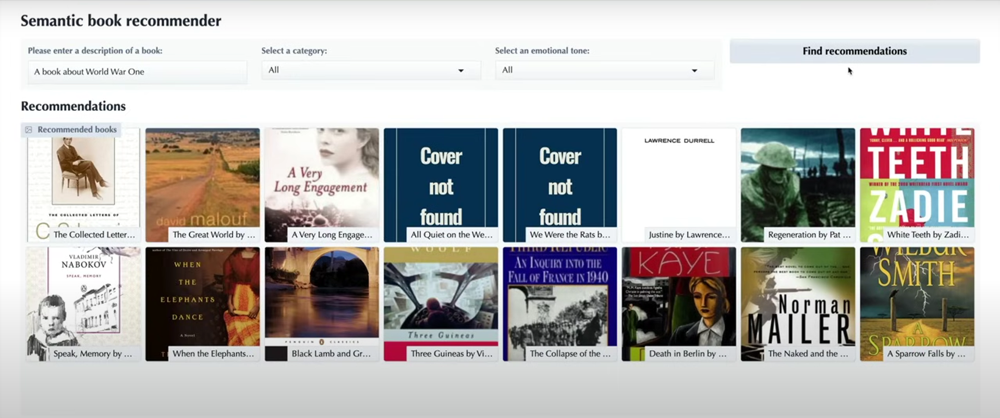

Semantic Book Recommender using LLMs 📚

This repository contains the complete code for building a semantic book recommender using LLMs, vector search, and sentiment analysis. It is based on the freeCodeCamp course "Build a Semantic Book Recommender with LLMs"

💡 Project Components
1. Text Data Cleaning 📄
   - Process raw book descriptions and clean the dataset (data-exploration.ipynb).

2. Vector Search & Semantic Recommendations 🔍
   - Build a vector database (vector-search.ipynb) for retrieving books similar to user queries, such as "a book about revenge."

3. Zero-Shot Text Classification 🎭
   - Use LLM-based classification (text-classification.ipynb) to label books as fiction or non-fiction for better filtering.

4. Sentiment-Based Book Sorting 🎭
   - Perform emotion extraction (sentiment-analysis.ipynb) to categorize books based on tone (joyful, suspenseful, sad, etc.).

5. Interactive Gradio Dashboard 🖥️
   - Implement a user-friendly web interface (gradio-dashboard.py) for seamless book recommendations.

🚀 Setup & Requirements
- Developed in Python 3.11.
- Install dependencies from requirements.txt:

- Main Dependencies:
- kagglehub
- pandas, matplotlib, seaborn
- python-dotenv
- langchain-community, langchain-opencv, langchain-chroma
- transformers
- gradio
- notebook, ipywidgets

📂 Data & API Setup
- To create your vector database, set up a .env file in the root directory containing your OpenAI API key or use HuggingFace if want to use the free models.
- Download the books dataset from Kaggle (instructions are included in the repo).

- 
## 📌 Final View: Book Recommendations Dashboard  
Below is a preview of the book recommender interface in action:  

